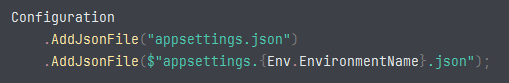
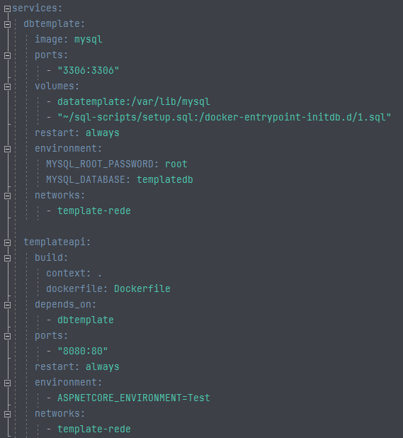
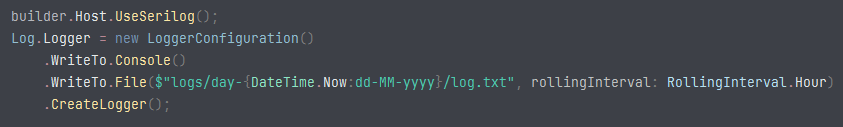
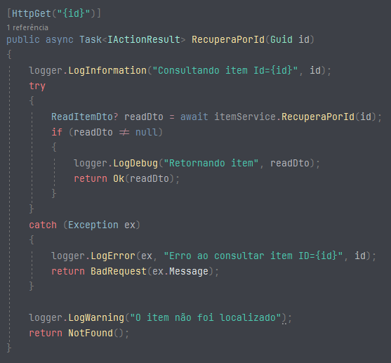
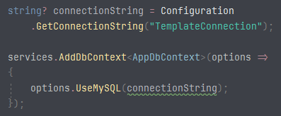
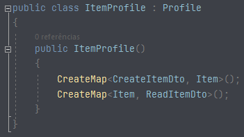
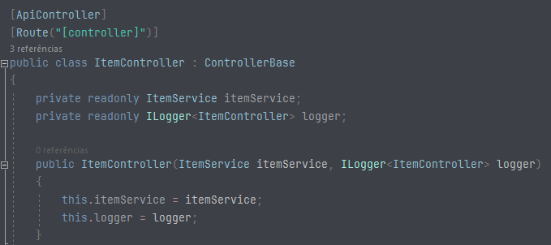
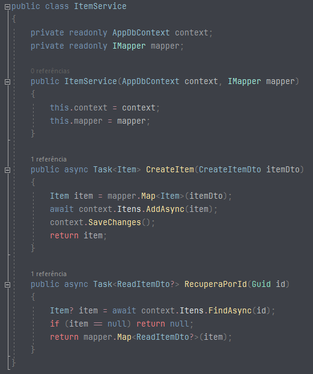

# Template para criação de APIs com ASP.NET Core

Este é um template que desenvolvi para agilizar na criação de APIs com o APS.NET Core 7.0, otimizando tempo e podendo ser mais produtivo.

para utilizar em sua máquina basta na pasta do projeto do projeto executar o comando para adicionar o template como opção para iniciar uma aplicação:

```
dotnet new install .\
```

Após isso basta na pasta que deseja desenvolver o projeto executar o comando:

```
dotnet new templateapi
```

## O template já vem com o seguinte configurado:

### appsettings.json
arquivos dedicados para cada ambiente.



### Docker
API já com docker configurado, possuindo também o docker-compose.yml para iniciar a aplicação junto com o container do banco de dados.



### Logs
Tendo o gerenciamento de logs feito através do Serilog, removendo os logs indesejados e armazenando todos os logs em arquivos de texto separados por dia e hora.



Controller:



### SGBD
Já configurada para se conectar a banco MySql, com connectionStrings já definidas para cada ambiente.



### Mapeamento de entidades
Tendo o AutoMapper configurado para facilitar o mapeamento.



### Exemplo
O sistema possui como base os serviços para criação e consulta de item apenas de demonstração, sendo separados em Controller e Service através da injeção de dependência.

Controller:



service:



LinkedIn: <a src="https://www.linkedin.com/in/mateusnunes620/">mateusnunes620</a>